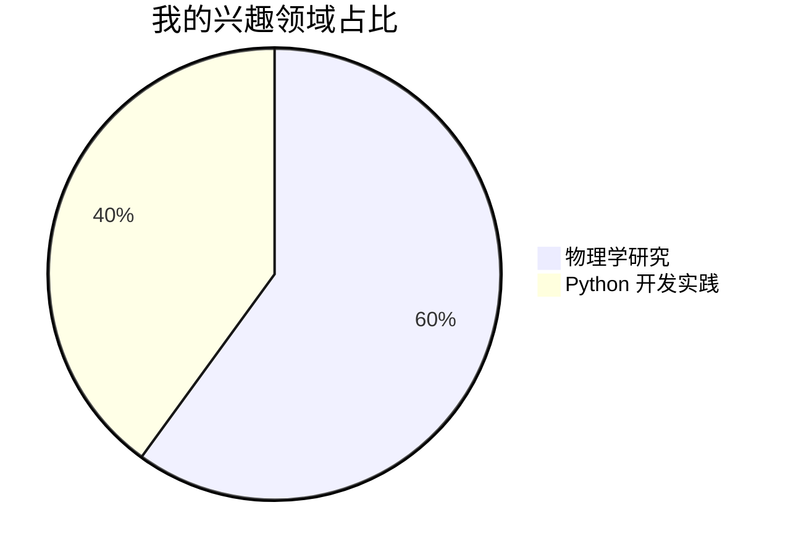
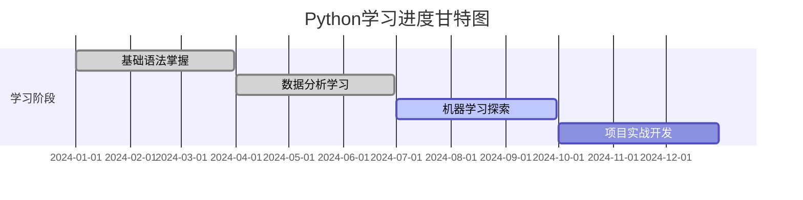
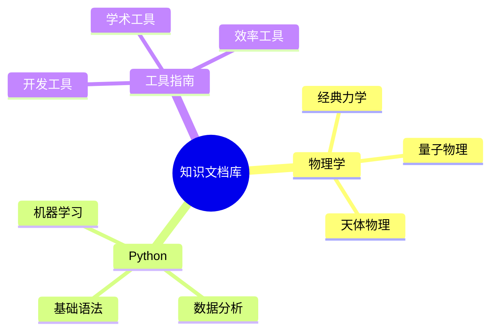

# 🌌 探索者 ngaodut 的数字宇宙

## 👋 来自知识星河的问候

你好！我是 **ngaodut**，一位永不停歇的知识宇宙探索者。在这片浩瀚的数字星空中，**物理世界的深邃奥秘**是我永恒追寻的璀璨星辰，而 **Python 语言的灵动魅力**则化作我探索未知的星际飞船，驱动我穿越重重迷雾，驶向更广阔的知识疆域。

## 🔭 兴趣焦点：物理与代码的交响

物理与编程，是我探索世界的双引擎。在物理的领域中，我痴迷于揭开宇宙万物的运行规律，从微观粒子的量子纠缠，到宏观天体的引力之舞，每一个物理概念都像一把神奇的钥匙，开启我对世界本质认知的崭新大门。

而 Python，作为我探索的得力工具，它简洁而强大的语法，丰富多样的库函数，为我构建起连接理论与实践的桥梁。借助 Python，我得以将复杂的物理理论转化为可视化的模型与模拟，让抽象的概念变得生动可触。

## 🌱 成长进行时：Python 学习之路

目前，我正全力沉浸在 Python 的学习海洋中，以热情为帆，以实践为桨。学习初期，我扎实掌握基础语法，为后续的进阶学习筑牢根基；随着学习深入，我开始探索数据分析、机器学习库的奇妙世界，在 Pandas 数据处理、Scikit-learn 模型构建等领域不断钻研。

每一次代码的编写，都是我在数字世界留下的探索足迹；每一个 Bug 的解决，都是我成长路上闪耀的里程碑。

## 🤝 期待与你携手同行

独行快，众行远！我热切期待与志同道合的伙伴们在 **物理模拟项目**、**Python 开源开发** 等领域展开深度合作。无论是攻克复杂的物理难题，还是开发实用的 Python 工具，我相信思维的碰撞能擦出最耀眼的火花。

如果你对以下方向感兴趣，欢迎随时联系我：

**物理模拟**：天体运动、分子动力学等模拟项目

**Python 开发**：数据分析工具、机器学习应用开发

**跨学科研究**：结合物理与编程的创新研究方向

## 📮 沟通桥梁：随时畅聊

如果你也对物理与编程充满热情，或是有合作的想法，欢迎随时通过 **gndut@outlook.com** 与我取得联系。无论是探讨学术问题，还是交流项目经验，我都期待与你展开一场精彩的对话！

## ✨ 知识宝藏：在线文档库

千万不要错过我的 [在线文档库](https://www.blgxwk.blog/)！这里是我精心搭建的知识家园，不仅有 **物理学习笔记**、**Python 实践心得**，还有 **各种工具使用指南**。每一篇文档都是我知识积累的结晶，涵盖从基础概念到高级应用的丰富内容。

快来开启这场知识之旅，我们一起在数字宇宙中并肩前行！

&#x20;
