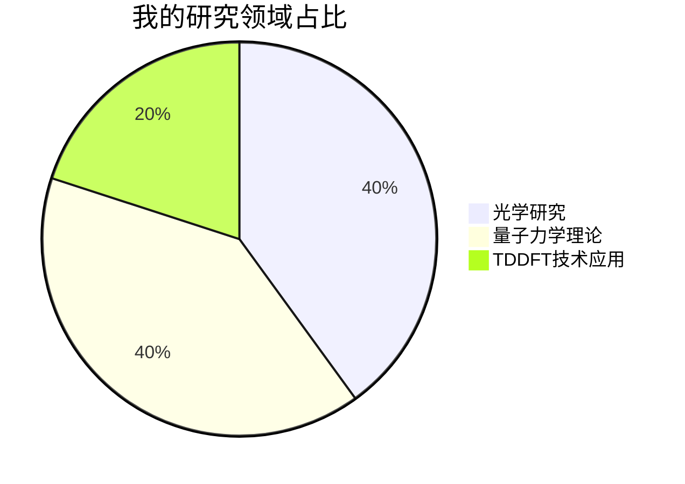
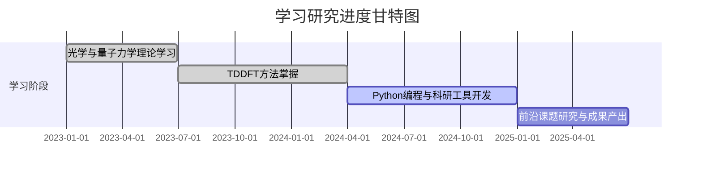
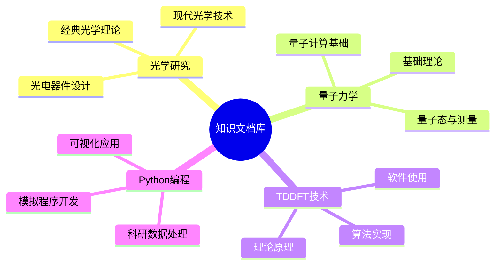

# 🌌 探索者 ngaodut 的数字宇宙

## 👋 来自知识星河的问候
你好！我是 **ngaodut**，一位深耕于光学与量子世界的探索者。在这片充满奥秘的知识宇宙中，我以代码为舟，以理论为帆，不断探索微观世界的奇妙规律，用技术揭开光学与量子力学的神秘面纱 。

## 🔭 兴趣焦点：光学与量子世界的深度探索
我的研究核心聚焦于 **光学** 与 **量子力学** 领域。在光学的世界里，光的干涉、衍射现象如同大自然谱写的美妙诗篇；而量子力学中微观粒子的奇特行为，更是颠覆了我们对世界的传统认知。

其中，**TDDFT（含时密度泛函理论）** 是我重要的研究工具，它能精准模拟分子和材料在外界扰动下的电子结构动态变化，帮助我在光与物质相互作用、新型光电器件开发等方向不断突破。

## 🌱 成长进行时：多维度的探索之路
在科研与技术学习的道路上，我始终保持着积极探索的姿态。一方面，深入钻研光学与量子力学的理论知识，不断夯实学术基础；另一方面，熟练运用Python等编程语言，借助TDDFT相关计算软件和工具，将理论转化为实际的研究成果 。

## 🤝 期待与你携手同行
独行快，众行远！我热切期待与志同道合的伙伴们在 **光学模拟项目**、**量子计算开发**、**TDDFT算法优化** 等领域展开深度合作。无论是攻克复杂的理论难题，还是开发更高效的计算工具，我相信思维的碰撞能擦出最耀眼的火花。

如果你对以下方向感兴趣，欢迎随时联系我：
- **光学模拟**：光与纳米结构相互作用、新型光学器件设计
- **量子计算**：量子算法开发、量子态模拟
- **TDDFT技术**：算法改进、软件优化与应用拓展

## 📮 沟通桥梁：随时畅聊
如果你也对光学与量子领域充满热情，或是有合作的想法，欢迎随时通过 **gndut@outlook.com** 与我取得联系。无论是探讨学术问题，还是交流项目经验，我都期待与你展开一场精彩的对话！

## ✨ 知识宝藏：在线文档库
千万不要错过我的 **[在线文档库](https://www.blgxwk.blog/)**！这里是我精心搭建的知识家园，不仅有 **光学与量子力学学习笔记**、**TDDFT技术详解**、**Python科研编程实践心得**，还有 **各类科研工具使用指南**。每一篇文档都是我知识积累的结晶，涵盖从基础概念到前沿应用的丰富内容。

快来开启这场知识之旅，我们一起在光学与量子的奇妙世界中并肩前行！ 
